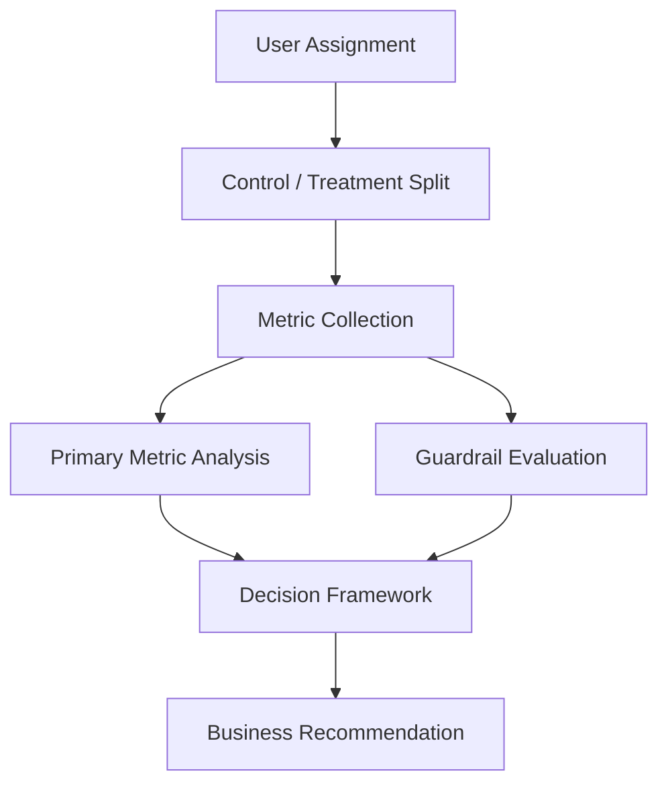
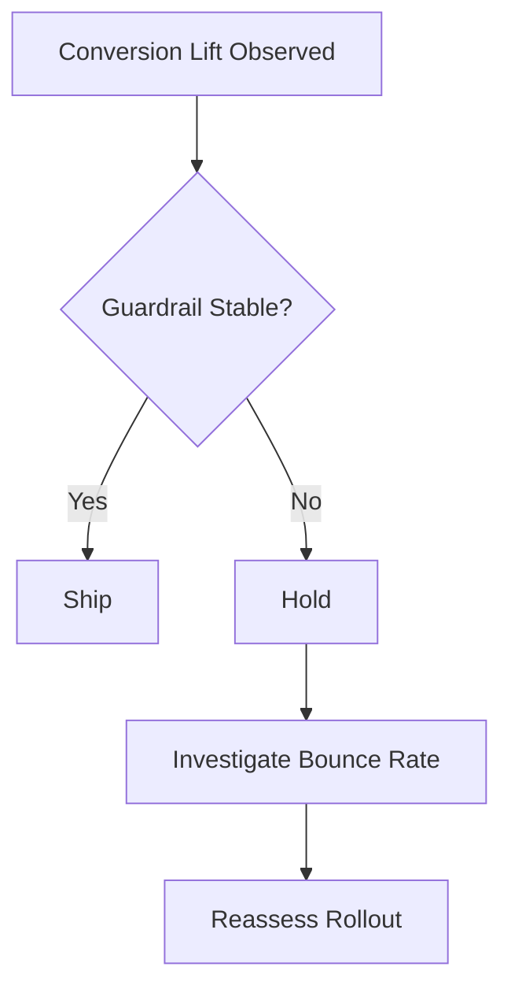
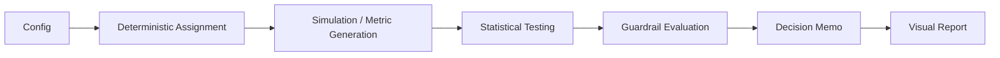
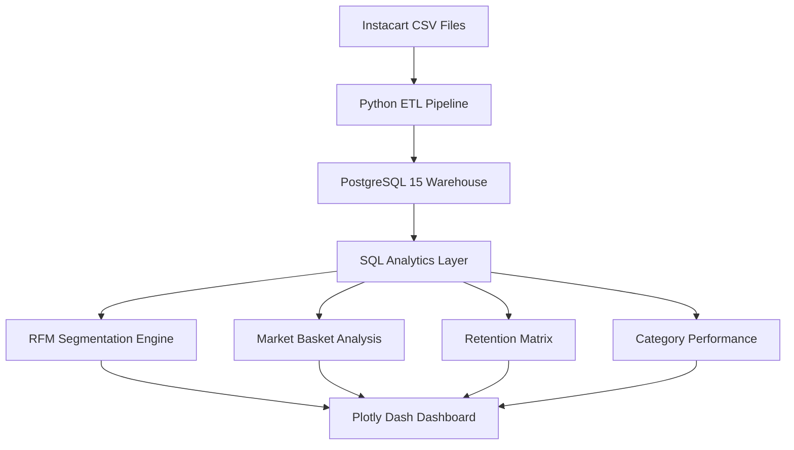

# Instacart Intelligence Platform
Customer Analytics · RFM Segmentation · Market Basket Analysis · Reorder Intelligence · Product Performance · Plotly Dash Dashboard

<<<<<<< HEAD
AB-Engine is a product analytics case study that evaluates a controlled A/B experiment end to end: from deterministic assignment and metric comparison to guardrail evaluation and final rollout decision. The experiment shows a statistically significant lift in conversion, but the final recommendation is HOLD because bounce rate worsened enough to require investigation before shipping.

## Executive Summary

This experiment compared a control landing page against a treatment variant using a balanced sample of 20,000 users. The treatment produced a statistically significant increase in conversion, but the predefined guardrail metric for bounce rate deteriorated enough to block rollout.

The central takeaway is simple: a positive primary metric is not sufficient on its own when a user-experience guardrail moves in the wrong direction.

## Business Impact

- Identified a 6.92% statistically significant improvement in conversion.
- Prevented a potentially harmful rollout by detecting a statistically significant increase in bounce rate through guardrail monitoring.
- Demonstrated a decision framework that balances business growth with user experience rather than optimizing a single KPI.

## Business Context

Product teams often need to decide whether an experiment is ready to ship based on more than one metric. A treatment can improve conversion while still creating friction in the user journey, and that tradeoff matters when the goal is sustainable product growth.

This project models that decision process in a way that is reproducible, audit-friendly, and easy to explain to stakeholders.

## Problem Statement

The core question is not whether the treatment improves conversion in isolation. The real question is whether the treatment improves the business outcome enough to justify the risk of harming user experience.

In this experiment, the treatment increased conversion, but bounce rate also increased. The framework therefore needed to evaluate both the upside and the downside before making a rollout recommendation.

## Hypothesis

The hypothesis was that the treatment variant would improve conversion relative to control without creating unacceptable degradation in guardrail metrics.

The experiment was designed to test whether the conversion lift was strong enough to support rollout, while also checking whether user-experience or business-quality metrics remained within acceptable bounds.

## Experiment Design

The experiment used deterministic, stateless user assignment so the same user always maps to the same variant across reruns. That makes the experiment reproducible and avoids bucket instability.

The sample was split evenly across variants:
- Control: 9,996 users.
- Treatment: 10,004 users.

The analysis compared primary performance on conversion and then evaluated guardrail metrics before reaching a final recommendation.

## Dataset

The experiment dataset contains simulated user-level observations for the landing page test.

### Key dataset facts
- Sample balance: A = 9,996, B = 10,004.
- Primary metric: conversion.
- Guardrail metrics: bounce rate, revenue per visitor, and sample balance.
- Output dataset: `data/simulated/landing_page_v2_experiment.csv`.

The dataset is structured to support straightforward statistical analysis and decision memo generation.

## Methodology

The workflow follows a standard experimentation lifecycle:
1. Assign users deterministically to control or treatment.
2. Simulate experiment outcomes.
3. Compare the primary conversion metric.
4. Evaluate guardrail metrics.
5. Generate a final decision memo.

The emphasis is on decision quality, not just statistical significance. The experiment is considered successful only if the primary metric improves and the guardrails remain acceptable.



## Statistical Testing

The primary metric used a two-sample proportion test to compare conversion rates between control and treatment. The result showed a statistically significant improvement in conversion.

The guardrail analysis separately evaluated bounce rate, revenue per visitor, and sample balance. The key decision point was not whether the treatment won on conversion, but whether the guardrails remained stable enough to support rollout.

## Primary Metric

### Conversion
- Control conversion: 14.86%.
- Treatment conversion: 15.88%.
- Relative lift: 6.92%.
- p-value: 0.04391.

The treatment delivered a statistically significant improvement in conversion, which is a positive signal for the product.

## Guardrail Metrics

### Bounce Rate
- Control bounce rate: 32.22%.
- Treatment bounce rate: 33.78%.
- p-value: 0.01948.

Bounce rate worsened enough to trigger a guardrail HOLD. This is a user-experience risk and should be investigated before any rollout decision.

### Revenue per Visitor
- Control: $12.24.
- Treatment: $12.70.

Revenue per visitor improved, which supports the treatment from a business-value perspective, but it does not override the bounce-rate concern.

### Sample Balance
- A: 9,996.
- B: 10,004.

The sample split is well balanced, which supports the validity of the comparison.

## Results

The experiment produced a mixed but informative result:
- Conversion improved significantly.
- Revenue per visitor improved.
- Bounce rate worsened significantly.

The analysis therefore supports a HOLD decision rather than an immediate ship recommendation. The treatment shows upside, but the guardrail deterioration means the experiment is not ready for rollout without further investigation.

## Business Recommendation

**HOLD: Guardrail risk needs investigation.**

The statistically significant conversion lift is not enough to ship when a predefined user-experience guardrail worsens. The correct product decision is to pause rollout, review the bounce-rate regression, and determine whether the treatment’s conversion gain is worth the added friction.



## Visual Story

The experiment summary is captured in a single visual report:


This figure brings together the conversion comparison, treatment-effect confidence interval, and guardrail summary in one place. It is the fastest way to understand why the result is not a straightforward ship decision.

## Production Considerations

This project is designed as a reproducible experimentation workflow, not as a deployed product system. The focus is on clear decision logic, deterministic assignment, transparent metrics, and auditable outputs.

Supporting artifacts, including a detailed implementation report (`REPORT.md`) and an automatically generated stakeholder decision memo (`data/simulated/decision_memo.md`), are included for reproducibility and auditability.

## Project Architecture


=======
An end-to-end retail analytics platform built on 3.4M+ Instacart grocery orders that segments 206K customers, identifies product affinity relationships, analyzes reorder behavior across 21 departments, and surfaces operational KPIs through an interactive multi-page Plotly Dash dashboard.

---

## Executive Summary

This project transforms raw grocery transaction data into a decision-ready analytics platform for customer retention, product strategy, and growth analysis.

It is designed to answer questions such as:
- Which customers are most valuable and most at risk?
- Which products and departments drive repeat purchases?
- What items are frequently bought together?
- Where should marketing and operations focus?

---

## Business Problem

Grocery and e-commerce retailers need to understand:
- Which customers are most valuable.
- Which customers are likely to churn.
- Which products and departments drive loyalty.
- Which items are often bought together.
- How retention and reorder behavior evolve over time.

Without structured analytics, retention and merchandising decisions remain reactive rather than data-driven.

---

## Dataset

**Instacart Market Basket Analysis** — Kaggle

| Metric | Value |
|---|---:|
| Total Orders | 3,421,083 |
| Unique Customers | 206,209 |
| Products | 49,688 |
| Departments | 21 |
| Reorder Rate | 59.0% |

### Files Used
- `orders.csv`
- `order_products__prior.csv`
- `order_products__train.csv`
- `products.csv`
- `aisles.csv`
- `departments.csv`

---

## System Architecture



---

## Solution Modules

### Module 1 — RFM Customer Segmentation
Scored 206,209 customers on Recency, Frequency, and Monetary value using SQL window functions and NTILE scoring.

### Segment Summary
| Segment | Customers |
|---|---:|
| Champions | 15,978 |
| Loyal Customers | 52,655 |
| New Customers | 24,233 |
| At Risk | 55,092 |
| Hibernating / Lost | 58,251 |

**Key insight:** 55,092 previously active customers show declining engagement signals and are the primary target for retention campaigns.

---

### Module 2 — Reorder & Retention Intelligence
Tracked customer order cohorts across 13 order milestones.

- Month 0–3: 100% retention.
- Month 6: 71% retention.
- Month 12: 42% retention.
- Produce department drives the highest reorder rate at 65%+, roughly 2x higher than average across all departments.

---

### Module 3 — Market Basket Analysis
Applied Apriori association rule mining on 15,000 sampled orders.

### Top Associations
- Organic Strawberries → Organic Raspberries, Lift: 3.26
- Bag of Organic Bananas → Organic Raspberries, Lift: 2.98
- Large Lemon → Organic Baby Spinach, Lift: 2.93
- Banana → Cucumber Kirby, Lift: 2.48

**Insight:** Organic produce items show the strongest cross-purchase affinity, creating bundling opportunities for promotions.

---

### Module 4 — Category & Product Performance
Top departments by purchase volume:
- Produce — 9.9M purchases, 65% reorder rate
- Dairy Eggs — 5.6M purchases
- Snacks — 3.0M purchases

Top products by volume:
- Banana — 491,291 purchases
- Bag of Organic Bananas — 394,930 purchases
- Organic Strawberries — 264,683 purchases

---

## Dashboard

The project includes a 4-tab interactive Plotly Dash application connected live to PostgreSQL.

### Page 1 — Executive Overview
- KPIs: Total Orders, Unique Customers, Products, Reorder Rate.
- Charts: Order volume by hour of day, order volume by day of week.

### Page 2 — Customer Analytics
- KPIs: Champions, Loyal, At Risk, Hibernating/Lost counts.
- Charts: RFM segment distribution, segment breakdown table.

### Page 3 — Product & Category
- Charts: Department performance and reorder rate, top 20 products by purchase volume with reorder rate heatmap.

### Page 4 — Market Basket Analysis
- Charts: Association rules scatter plot, top rules table with filter and sort.

---

## Dashboard Preview

### Executive Overview


### Customer Analytics


### Product & Category


### Market Basket Analysis


---

## Tech Stack

| Layer | Technology |
|---|---|
| Database | PostgreSQL 15 (Docker) |
| ETL | Python, pandas, psycopg2 |
| Analytics | SQL, CTEs, Window Functions, NTILE |
| ML | mlxtend, Apriori, Association Rules |
| Dashboard | Plotly Dash, Dash Bootstrap Components |
| Orchestration | Docker, Docker Compose |

---
>>>>>>> 356360c (#)

## Repository Structure

```text
<<<<<<< HEAD
ab_engine/
├── README.md
├── REPORT.md
├── config/
│   └── experiment_config.yaml
├── data/
│   └── simulated/
│       ├── experiment_results_chart.png
│       ├── decision_memo.md
│       └── landing_page_v2_experiment.csv
├── main.py
├── notebooks/
│   └── 01_experiment_walkthrough.ipynb
├── requirements.txt
└── src/
    └── engine/
        ├── randomization.py
        ├── simulator.py
        └── stats.py
```

## Key Learnings

- Statistical significance alone is not enough to justify a rollout.
- Guardrail metrics are essential for balancing growth and user experience.
- Deterministic assignment makes experimentation reproducible and easier to audit.
- A concise decision memo is often more valuable than a long technical explanation when communicating results.

## How to Run

```bash
python main.py
```

The project also includes a notebook walkthrough and generated output files in `data/simulated/` for review.

## Technologies Used

- Python
- NumPy
- pandas
- SciPy
- Matplotlib
- YAML
- Jupyter Notebook
- Mermeid.js
=======
instacart-intelligence-platform/
├── dashboard/
│   └── app.py
├── data/
│   └── raw/
├── sql/
│   ├── schema.sql
│   ├── rfm_analysis.sql
│   ├── retention_matrix.sql
│   └── category_deepdive.sql
├── src/
│   ├── database_loader.py
│   ├── market_basket.py
│   └── clv_rfm_engine.py
├── reports/
│   ├── executive_overview.png
│   ├── customer_analytics.png
│   ├── product_category.png
│   └── market_basket.png
├── docker-compose.yml
└── README.md
```

---

## How to Run

```bash
# 1. Clone and enter project
git clone <repo-url>
cd instacart-intelligence-platform

# 2. Download dataset from Kaggle and place CSVs in data/raw/

# 3. Start PostgreSQL
docker compose up -d

# 4. Create schema
docker exec -i instacart_postgres psql \
  -U postgres -d instacart_db < sql/schema.sql

# 5. Load data
python src/database_loader.py

# 6. Run RFM segmentation
docker exec -i instacart_postgres psql \
  -U postgres -d instacart_db < sql/rfm_analysis.sql

# 7. Run market basket analysis
python src/market_basket.py

# 8. Launch dashboard
python dashboard/app.py
# Open http://127.0.0.1:8050
```

---

## Key Metrics

- 3,421,083 orders analyzed.
- 206,209 customers segmented into 5 RFM tiers.
- 55,092 at-risk customers identified for retention targeting.
- 59% platform reorder rate.
- 3.26x lift on the top product association rule.
- 42% 12-order cohort retention rate.

---

## What This Demonstrates

- Production ETL pipeline handling 3.4M+ rows with chunked bulk loading.
- SQL analytics using window functions, CTEs, and NTILE scoring.
- Behavioral customer segmentation at scale.
- Association rule mining for product affinity discovery.
- Multi-page interactive dashboard connected to a live database.
- Docker-based reproducible warehouse environment.
>>>>>>> 356360c (#)
