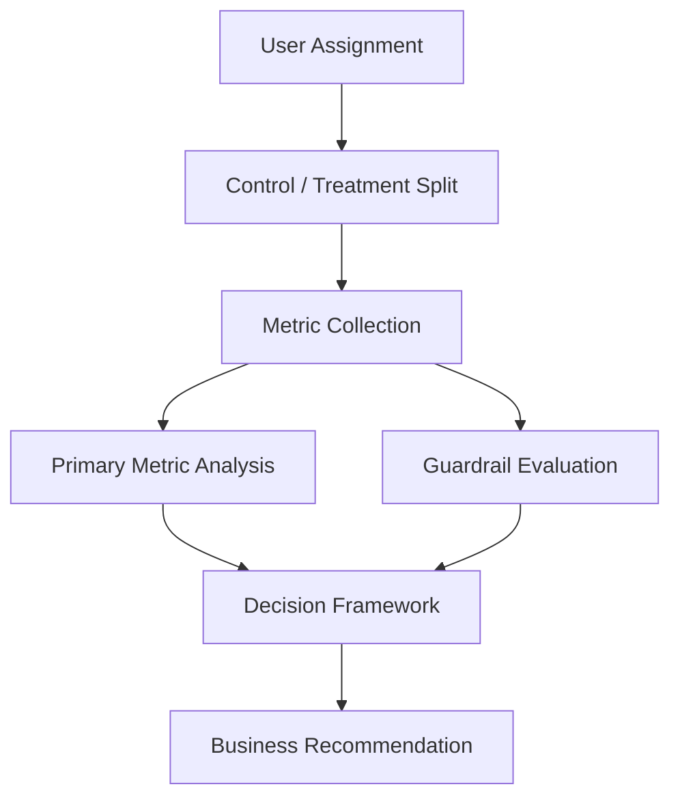
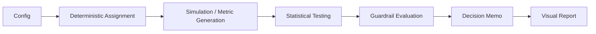

# AB-Engine: Product Experimentation & Guardrail Decision Framework


## Portfolio Highlights

- Evaluated a 20,000-user landing page A/B test with balanced control and treatment groups.
- Detected a statistically significant 6.92% conversion lift.
- Identified a statistically significant bounce-rate regression that blocked rollout.
- Generated a stakeholder-ready HOLD recommendation using primary and guardrail metrics.

## Executive Summary

AB-Engine is a product experimentation case study that evaluates a controlled A/B test from assignment and metric comparison to guardrail review and rollout decision. The treatment improved conversion, but the final recommendation remained HOLD because bounce rate worsened enough to require investigation before shipping.

This project demonstrates how to make product decisions under metric tradeoffs, not just how to calculate p-values.

## Business Problem

Product teams need to decide whether a treatment is worth shipping when multiple metrics move in different directions. A variant can improve conversion while still creating friction in the user journey, and that tradeoff matters when the goal is sustainable product growth.

This project models that decision process in a reproducible, audit-friendly way. It shows how experiment analysis can support business decisions that balance growth, user experience, and rollout risk.

## Key Insights

- Treatment conversion increased from 14.86% to 15.88%, a 6.92% relative lift.
- The conversion lift was statistically significant with p = 0.04391.
- Bounce rate worsened from 32.22% to 33.78%, with p = 0.01948.
- Revenue per visitor improved from $12.24 to $12.70.
- Final recommendation: HOLD, because guardrail risk outweighs immediate rollout confidence.

## Business Recommendation

**HOLD: Guardrail risk needs investigation.**

The statistically significant conversion lift is not enough to ship when a predefined user-experience guardrail worsens. The correct product decision is to pause rollout, review the bounce-rate regression, and determine whether the treatment’s conversion gain is worth the added friction.

## Visual Story

The experiment summary is captured in a single visual report:


This figure brings together the conversion comparison, treatment-effect confidence interval, and guardrail summary in one place. It is the fastest way to understand why the result is not a straightforward ship decision.

## Experiment Context

The experiment compared a control landing page against a treatment variant using a balanced sample of 20,000 users. The primary question was not whether the treatment improved conversion in isolation, but whether the improvement was strong enough to justify the risk of harming user experience.

The working hypothesis was that the treatment would improve conversion relative to control without creating unacceptable degradation in guardrail metrics.

## Dataset

The experiment dataset contains simulated user-level observations for the landing page test.

### Key dataset facts
- Sample balance: A = 9,996, B = 10,004.
- Primary metric: conversion.
- Guardrail metrics: bounce rate, revenue per visitor, and sample balance.
- Output dataset: `data/simulated/landing_page_v2_experiment.csv`.

The dataset is structured to support straightforward statistical analysis and decision memo generation.

## Methodology

The workflow follows a standard experimentation lifecycle:
1. Assign users deterministically to control or treatment.
2. Simulate experiment outcomes.
3. Compare the primary conversion metric.
4. Evaluate guardrail metrics.
5. Generate a final decision memo.

The emphasis is on decision quality, not just statistical significance. The experiment is considered successful only if the primary metric improves and the guardrails remain acceptable.



## Statistical Testing

The primary metric uses a two-sample proportion test to compare conversion rates between control and treatment. The result showed a statistically significant improvement in conversion.

The guardrail analysis separately evaluated bounce rate, revenue per visitor, and sample balance. The key decision point was not whether the treatment won on conversion, but whether the guardrails remained stable enough to support rollout.

## Primary Metric

### Conversion
- Control conversion: 14.86%.
- Treatment conversion: 15.88%.
- Relative lift: 6.92%.
- p-value: 0.04391.

The treatment delivered a statistically significant improvement in conversion, which is a positive signal for the product.

## Guardrail Metrics

### Bounce Rate
- Control bounce rate: 32.22%.
- Treatment bounce rate: 33.78%.
- p-value: 0.01948.

Bounce rate worsened enough to trigger a guardrail HOLD. This is a user-experience risk and should be investigated before any rollout decision.

### Revenue per Visitor
- Control: $12.24.
- Treatment: $12.70.

Revenue per visitor improved, which supports the treatment from a business-value perspective, but it does not override the bounce-rate concern.

### Sample Balance
- A: 9,996.
- B: 10,004.

The sample split is well balanced, which supports the validity of the comparison.

## Results

The experiment produced a mixed but informative result:
- Conversion improved significantly.
- Revenue per visitor improved.
- Bounce rate worsened significantly.

The analysis therefore supports a HOLD decision rather than an immediate ship recommendation. The treatment shows upside, but the guardrail deterioration means the experiment is not ready for rollout without further investigation.

## Production Considerations

This project is designed as a reproducible experimentation workflow, not as a deployed product system. The focus is on clear decision logic, deterministic assignment, transparent metrics, and auditable outputs.

Supporting artifacts, including a detailed implementation report (`REPORT.md`) and an automatically generated stakeholder decision memo (`data/simulated/decision_memo.md`), are included for reproducibility and auditability.

## Project Architecture



## Repository Structure

```text
ab_engine/
├── README.md
├── REPORT.md
├── config/
│   └── experiment_config.yaml
├── data/
│   └── simulated/
│       ├── experiment_results_chart.png
│       ├── decision_memo.md
│       └── landing_page_v2_experiment.csv
├── main.py
├── notebooks/
│   └── 01_experiment_walkthrough.ipynb
├── requirements.txt
└── src/
    └── engine/
        ├── randomization.py
        ├── simulator.py
        └── stats.py
```

## How to Run

```bash
python main.py
```

The project also includes a notebook walkthrough and generated output files in `data/simulated/` for review.

## Technologies Used

- Python.
- NumPy.
- pandas.
- SciPy.
- Matplotlib.
- YAML.
- Jupyter Notebook.
- Mermaid.js.

## Limitations

- The project is a reproducible experimentation case study, not a deployed product system.
- Guardrail decisions are based on the metrics defined in the project, not on broader product telemetry.
- The experiment uses simulated user-level observations for demonstration and analysis.
- The project does not add any infrastructure beyond what is already in the repository.
